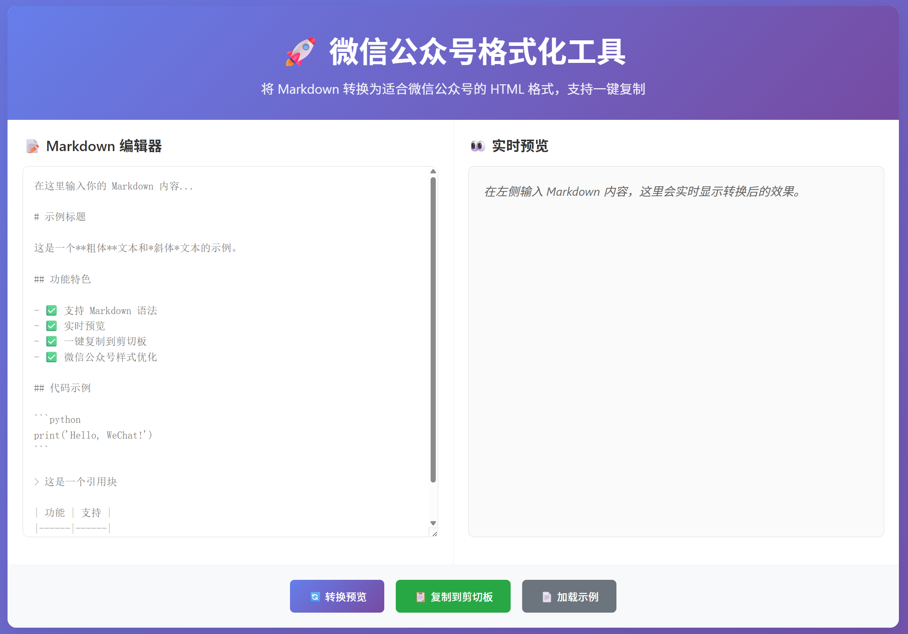

# WeChat Format Python

一个基于 Python 的微信公众号 Markdown 格式化工具，支持命令行和 Web 界面两种使用方式。

## ✨ 特性

- 🐍 **Python 技术栈**：基于 Python 开发，易于扩展和维护
- 📋 **富文本复制**：自动将转换结果以富文本格式复制到剪切板，可直接粘贴到微信公众号
- 🖥️ **命令行工具**：支持批量处理和脚本集成
- 🌐 **Web 界面**：提供实时预览和在线编辑
- 🎨 **样式优化**：专门针对微信公众号优化的样式
- 📱 **移动适配**：确保在移动端完美显示

## 🚀 快速开始

### 安装

```bash
# 克隆项目
git clone https://github.com/Hesper-L/wechat-format-py.git
cd wechat-format-py

# 安装依赖
pip install -r requirements.txt

# 安装包（开发模式）
pip install -e .
```

### 命令行使用

```bash
# 生成示例文件
wechat-format demo

# 转换文件并复制到剪切板（推荐）
wechat-format copy input.md

# 转换文件并保存到指定位置
wechat-format convert input.md -o output.html

# 启动 Web 界面
wechat-format serve

# 预览转换结果
wechat-format preview input.md
```

### Python 包使用

```python
from wechat_format import WeChatFormatter

formatter = WeChatFormatter()

# 转换 Markdown 文本
html_content = formatter.convert("# 标题\n\n这是内容")

# 转换文件
html_content = formatter.convert_file("input.md")

# 复制到剪切板（富文本格式）
formatter.copy_to_clipboard(html_content)
```

## 📦 项目结构

```
wechat-format-py/
├── wechat_format/          # 主包
│   ├── __init__.py
│   ├── converter.py        # 核心转换器
│   ├── styles.py          # 样式定义
│   ├── cli.py             # 命令行接口
│   └── web.py             # Web 界面
├── requirements.txt      # 依赖列表
├── setup.py             # 安装脚本
└── README.md            # 项目说明
```

## 🛠️ 技术栈

- **核心**：Python 3.7+
- **Markdown 解析**：markdown2 / mistune
- **Web 框架**：Flask
- **剪切板操作**：pyperclip + pywin32（Windows富文本支持）
- **命令行**：click
- **样式处理**：Jinja2

## 📋 开发状态

- [x] 项目结构设计
- [x] 核心转换器开发
- [x] 命令行接口实现
- [x] Web 界面开发
- [x] 富文本复制功能
- [x] 样式优化和测试

## 🎯 使用说明

1. **复制功能**：使用 `wechat-format copy` 命令可以将转换后的内容以富文本格式复制到剪切板，直接粘贴到微信公众号编辑器即可保持格式。

2. **Web 界面**：使用 `wechat-format serve` 启动本地服务器，在浏览器中访问 `http://localhost:5000` 进行在线编辑和预览。

3. **命令行工具**：支持多种子命令，使用 `wechat-format --help` 查看完整帮助信息。

## 🤝 贡献

欢迎提交 Issue 和 Pull Request！

## 📄 许可证

MIT License

---

基于 [lyricat/wechat-format](https://github.com/lyricat/wechat-format) 的 Python 实现版本。